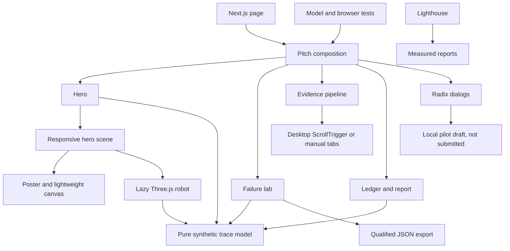

# Handoff Knowledge Graph

VERIFIED:

- User source PDFs -> reviewed text and source manifest -> physical-AI requirements.
- backend -> evaluation, provenance and governance mechanisms.
- web -> existing operations console -> backend API.
- handoff -> continuation instructions -> preserves existing work.

PLANNED: Separate pitch site -> deterministic demonstration fixtures -> illustrative product story. No marketing mock is production evidence.

## Current Frontend Map

VERIFIED file relationships are mirrored in knowledge-graph.json. All graph paths must exist; graph edges must resolve to node IDs.

## Procedural Graph

No edge from the pitch site to the engineering backend claims a live integration. `demo-model -> engine` is explicitly an illustrative mock relationship, not formula equivalence. The old graphify snapshot is retained as historical source context.